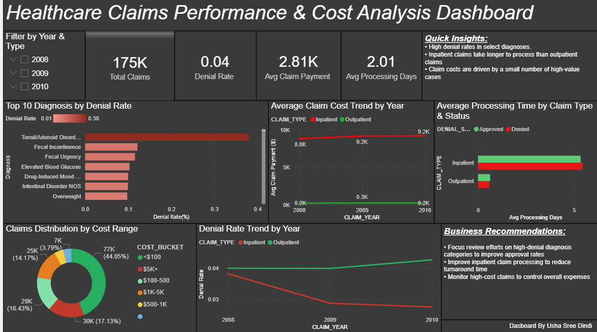

# Medicare Claims Analytics — Power BI Dashboard & ML Denial Prediction
## 📊 Project Overview
An end-to-end healthcare analytics project analyzing 175,000+ Medicare 
claims from 2008-2010 using CMS public data. Built a complete data 
pipeline from raw government data to an interactive Power BI dashboard.

## 🎯 Business Questions Answered
- Which diagnosis codes have the highest claim denial rates?
- How do inpatient vs outpatient costs trend over time?
- What is the distribution of claims across cost ranges?
- How does processing time differ between approved and denied claims?

## 🔍 Key Insights
- Tonsil/Adenoid Disorders flagged at 37.9% denial rate — 9x above average
- Inpatient claims average $9,200 vs Outpatient $251 — 36x cost difference
- Inpatient denial rates improved 26% from 2008 to 2010
- 44% of all claims fall under $100 but high-cost cases drive total spend
- Outpatient denial rates rising year over year (4.0% → 4.5%)

## 🛠️ Tools & Technologies
| Tool | Purpose |
|---|---|
| Python (Pandas) | Data cleaning, joining, transformation |
| Google Colab | Cloud-based data processing |
| Power BI | Dashboard design and visualization |
| CMS Medicare SynPUF | Data source |

## 📁 Data Source
- **Source:** CMS Medicare Claims Synthetic Public Use Files (SynPUFs)
- **Link:** https://www.cms.gov/data-research/statistics-trends-and-reports/medicare-claims-synthetic-public-use-files
- **Files Used:** Beneficiary Summary, Inpatient Claims, Outpatient Claims
- **Sample:** DE1.0 Sample 1 (2008-2010)
- **Records:** 175,000+ claims after cleaning

## 📊 Dashboard Visuals
1. **KPI Cards** — Total Claims, Denial Rate, Avg Payment, Avg Processing Days
2. **Top 10 Diagnosis Codes by Denial Rate** — Red gradient bar chart
3. **Average Claim Cost Trend by Year** — Inpatient vs Outpatient line chart
4. **Processing Time by Claim Type** — Approved vs Denied comparison
5. **Claims Distribution by Cost Range** — Donut chart
6. **Denial Rate Trend by Year** — 3-year trend by claim type

## 💡 Business Recommendations
- Focus review efforts on high-denial diagnosis categories to improve approval rates
- Improve inpatient claim processing to reduce turnaround time
- Monitor high-cost claims to control overall expenses

## 🚀 How to Run
1. Download the CMS SynPUF data from the link above
2. Run `healthcare_claims_pipeline.ipynb` in Google Colab
3. Load `Healthcare_Claims_Dashboard.pbix` in Power BI Desktop

## 📸 Dashboard Preview

## 🤖 Part 2: Machine Learning Analysis

In addition to the Power BI dashboard, I built an ML pipeline 
to predict claim denials using patient demographics and chronic 
conditions.

**Key findings:**
- Detected and fixed data leakage (payment amount encoding target)
- Applied SMOTE to handle 96/4 class imbalance
- State code accounts for 45% of feature importance — geography 
  predicts denials more than patient health conditions
- Risk profiling shows 21x denial rate difference between 
  High and Low Risk tiers despite modest model accuracy
- CMS SynPUF denial flags appear randomly assigned — 
  a genuine data quality finding worth noting

**Tools:** Python, Scikit-learn, SMOTE, Matplotlib

## 👩‍💻 Author
**Usha Sree Dindi**  
[LinkedIn](https://www.linkedin.com/in/ushasree-dindi-9439a4252/) | [Email](mailto:usha.sree.dindi.2000@gmail.com)
